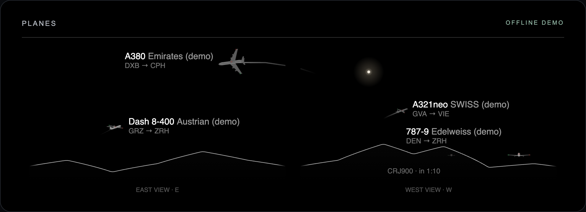

# MMM-PlaneHorizon

**Know what’s crossing your sky.** A [MagicMirror²](https://magicmirror.builders/) module that places nearby aircraft above the skyline seen from your windows.



*Screenshot of the included offline demo ([full demo page](docs/screenshot.png)), enlarged for readability. Aircraft and skyline are synthetic. No home photographs or live flight records are included.*

- Small 3D aircraft models with type-specific shapes, airline colours, sunlight and navigation lights.
- Flight labels with aircraft type, airline and route when metadata is available.
- Multiple viewing directions, configurable window width, roof limit and skyline.
- Predictions for aircraft about to enter your view on their current track.
- Canvas rendering at 4 FPS by default, cached aircraft sprites, no runtime npm dependencies.
- Offline demo to try before creating an API account.

Visibility is a geometric estimate. Clouds, haze, missing coverage, inaccurate heights and changing flight paths can make it wrong. This is a casual display, not a navigation or safety tool.

## Quick start: no account required

Use an existing working MagicMirror² installation and the Node version that installation requires. The module uses ES2018 and originated on MagicMirror 2.18 / Raspberry Pi 4. Development tests need Node 18+.

```sh
cd ~/MagicMirror/modules
git clone https://github.com/mkubicek/MMM-PlaneHorizon.git
```

No `npm install` is needed. Add this entry to the `modules` array in `~/MagicMirror/config/config.js`, then restart MagicMirror:

```js
{
  module: "MMM-PlaneHorizon",
  position: "top_right",
  header: "Planes",
  config: {
    demo: true,
    width: 420,
    height: 170,
  },
},
```

Demo mode uses an illustrative skyline and five fictional flights labelled `(demo)`. It does **not** contact OpenSky or adsbdb, and does not read credentials. It overrides `horizonFile`. Remove `demo: true` once your own location and API access are configured.

To preview the renderer on a computer without MagicMirror:

```sh
cd MMM-PlaneHorizon
npm run demo
# Open http://127.0.0.1:8098
```

The browser preview is a fixed synthetic scene, listens on localhost only, and stops with Ctrl+C.

## Configure your location and windows

```sh
cd ~/MagicMirror/modules/MMM-PlaneHorizon
cp examples/site.example.json site.local.json
nano site.local.json
node tools/configure.js site.local.json
```

Edit the example coordinates first: they describe a generic point near Greenwich, **not your location**. The tool creates Git-ignored `horizon.local.json`. It refuses to overwrite files. To regenerate, move your old horizon aside or supply a new output filename as the second argument.

```json
{
  "latitude": 51.5,
  "longitude": 0,
  "eyeAltitudeM": 30,
  "geoidUndulationM": 0,
  "views": [
    {
      "name": "West window",
      "direction": 270,
      "fieldOfView": 120,
      "maxElevation": 70,
      "skyline": [[0, 0], [180, 2], [230, 8], [270, 4], [310, 1]]
    }
  ]
}
```

| Field | Meaning |
|---|---|
| `latitude`, `longitude` | Viewing position in decimal degrees. North/east positive, south/west negative. Supported latitude: −85° to 85°. |
| `eyeAltitudeM` | Eye height above mean sea level, in metres: ground elevation plus floor and eye height. |
| `geoidUndulationM` | Optional local ellipsoid minus mean sea-level height, metres; default 0 is an approximation. |
| `views` | 1–8 views at this location. Prefer non-overlapping directions. |
| `name` | Caption under the opening. |
| `direction` | True compass direction out of the window: N=0, E=90, S=180, W=270. |
| `fieldOfView` | Horizontal opening width in degrees, up to 180; default 160. |
| `maxElevation` | Highest visible angle above horizontal, e.g. below a roof; default 90. |
| `skyline` | Optional `[true azimuth, elevation]` samples in degrees. At least two distinct azimuths from 0 up to but excluding 360. Interpolates around north. Omit for a flat 0° horizon. |

Use a compass and approximate elevation angles to start. Horizontal is 0°, a modest obstruction might be 10°, overhead is 90°. The public tool **does not download terrain** or infer buildings/trees. A flat horizon overestimates what you can see. More skyline samples improve the approximation. See [advanced horizon data](docs/horizon.md) for measured profiles.

## Get an OpenSky API client

Live positions come from [OpenSky Network](https://opensky-network.org/). An account is not blanket permission to use its data: the [current terms](https://opensky-network.org/about/terms-of-use) require written licensing for operational API use, including automated live displays. Check eligibility and arrange appropriate access before enabling live mode. The MIT licence here covers module code, not provider data.

1. Create an OpenSky account and sign in.
2. Visit the [Account page](https://opensky-network.org/my-opensky/account). Under **API Client**, create a client and copy its client ID and secret. If the card or access is unavailable, follow OpenSky's account/access guidance; this module cannot grant access.
3. Store the pair on the MagicMirror machine, as the **same operating-system user** that runs the Node helper:

   ```sh
   mkdir -p ~/.config/MMM-PlaneHorizon
   chmod 700 ~/.config/MMM-PlaneHorizon
   (umask 077; touch ~/.config/MMM-PlaneHorizon/opensky.json)
   nano ~/.config/MMM-PlaneHorizon/opensky.json
   chmod 600 ~/.config/MMM-PlaneHorizon/opensky.json
   ```

   File contents — replace both placeholders:

   ```json
   {
     "clientId": "YOUR_CLIENT_ID",
     "clientSecret": "YOUR_CLIENT_SECRET"
   }
   ```

4. Restart MagicMirror. The helper obtains and refreshes OAuth tokens automatically. Do not use your account password as the secret or put credentials in `config.js`.

For Docker, mount the file read-only under the container runtime user's home, readable by that user. For PM2/systemd, check the service user. There is no browser-config credential fallback.

[OpenSky's official API guide](https://openskynetwork.github.io/opensky-api/rest.html) documents OAuth and quotas. At writing, standard accounts have 4,000 daily credits and anonymous access 400. Small area queries cost one credit. The 30-second default uses about 2,880 daily; larger regions or other clients on the account cost more. Missing credentials enforce at least 240 seconds between requests. HTTP 429 pauses polling for the provider's retry interval. Quotas/access can change.

Types and scheduled routes come from [adsbdb](https://www.adsbdb.com/) without a key, only for displayed aircraft. Metadata is cached; routes can be missing, stale or incorrect.

## Enable live mode

After generating a horizon and configuring authorised API access:

```js
{
  module: "MMM-PlaneHorizon",
  position: "top_right",
  header: "Planes",
  config: {
    horizonFile: "horizon.local.json",
    width: 420,
    height: 170,
    pollSeconds: 30,
    quietHours: { from: "23:00", to: "06:00" },
    // facingDeg: 180, // optional: direction you face when looking AT the mirror
  },
},
```

The site file's `direction` describes looking **out of a window**. Module `facingDeg` describes looking **at the mirror** and rotates the 360° strip to order the panels. Leave `facingDeg` unset at first.

## Options

| Option | Default | Purpose |
|---|---|---|
| `horizonFile` | `"horizon.local.json"` | Horizon path relative to this module. |
| `demo` | `false` | Offline sample traffic/skyline; overrides `horizonFile`. |
| `width` | `365` | Canvas width in CSS pixels. |
| `height` | `150` | Sky height; captions add 26 px. |
| `facingDeg` | `null` | Strip centre direction; unset puts the first view on the left. |
| `planeScale` | `1` | Model size multiplier; distance and aircraft length also affect size. |
| `fps` | `4` | Rendering rate, independent of API polling. |
| `lineSmoothingDeg` | `3` | Visual skyline smoothing; 0 disables. Visibility uses the unsmoothed data. |
| `pollSeconds` | `30` | Live poll interval; minimum 10, or 240 anonymously. |
| `quietHours` | `null` | `{from: "23:00", to: "06:00"}` in the helper's local timezone; pauses polling. |
| `radiusKm` | `60` | Requested bounding-box radius. Box clips at ±180° longitude, omitting traffic across the date line. |
| `visibleRangeKm` | `40` | Maximum visible geometric range; keep within `radiusKm`. |
| `lookAheadSeconds` | `240` | Prediction horizon on current velocity. |
| `maxUpcoming` | `2` | Limit on aircraft about to enter view. |

Use **one configured instance per MagicMirror server**. Multiple browsers share its feed; separate sites/instances are unsupported. Small 3D models are projected onto 2D canvas: no WebGL or graphics-driver changes needed. CPU depends on traffic, resolution and frame rate; start at 4 FPS.

## Troubleshooting

- **Setup/missing horizon message:** generate `horizon.local.json` in the module directory, check JSON and the filename, then restart. Try demo mode to separate setup from network issues.
- **No aircraft:** check server logs, coverage, location, elevation, direction, skyline and quiet hours. Only geometrically visible or upcoming aircraft appear.
- **401/403:** confirm client credentials, runtime user/file permissions and account access. Basic password authentication is unsupported. Missing/malformed credentials are logged.
- **429:** wait for the retry interval. Increase `pollSeconds` or add quiet hours; other applications may share the quota.
- **Missing type/route:** adsbdb may lack a record or be unavailable. Fallback labels still display.
- **Flights during an outage:** old positions are extrapolated and a stale-data status is shown. They are not fresh observations.
- **High CPU:** lower `fps`, dimensions, `lookAheadSeconds` or `maxUpcoming`.

## Privacy, updates and removal

Your horizon identifies a location. Personal `.local.json`, credentials and photos are Git-ignored, but **Git ignore does not prevent web access**: MagicMirror serves horizon data to its browsers. Keep the dashboard on a trusted network. OpenSky receives the query box; adsbdb receives requested aircraft IDs/callsigns. Tokens stay in the helper.

```sh
cd ~/MagicMirror/modules/MMM-PlaneHorizon
git pull --ff-only
# Restart with your normal service manager.
```

Personal `.local.json` files survive updates. To remove, delete the module's config entry and restart; then remove its directory and the separate credentials file if no longer needed.

## Development

```sh
npm test       # Node 18+, no install required
npm run demo   # deterministic browser preview
```

Tests cover geometry, skyline setup, models, label placement, state parsing and offline/provider behaviour. CI runs on Node 22 and 24. ES2018 compatibility guards are not certification of every MagicMirror/Node combination. The public build is tested with a browser module harness and synthetic traffic, not deployed over the private installation.

Issues/PRs are welcome. Include versions, revision and redacted logs; never attach secrets or personal horizon data. Include tests for geometry/feed changes. [MIT licence](LICENSE).
